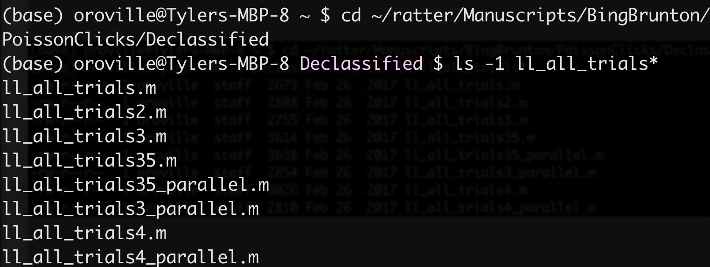
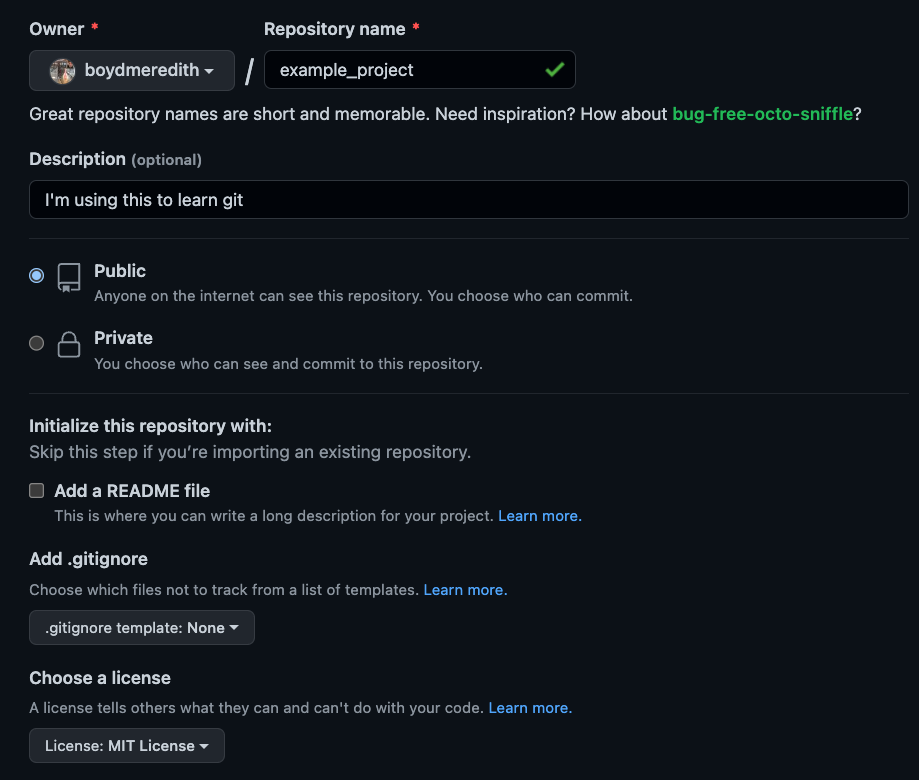
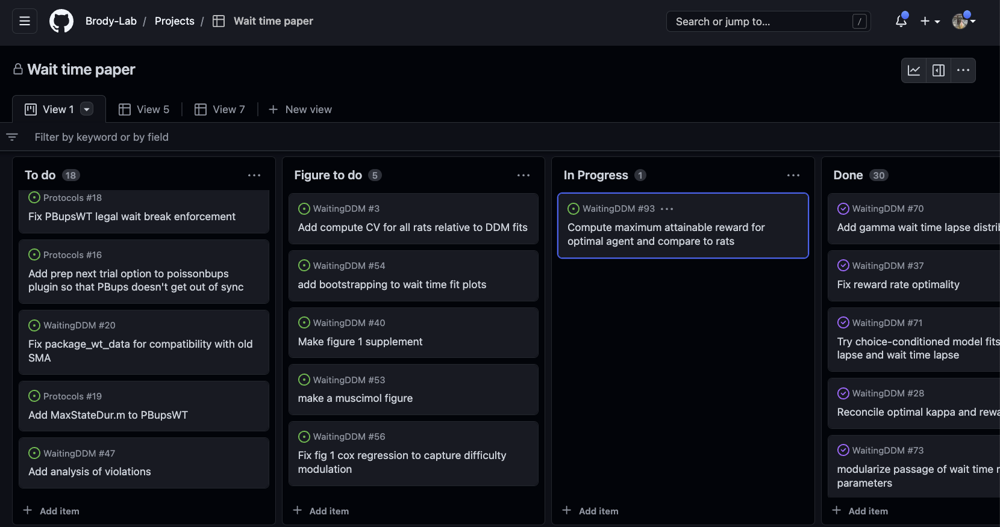
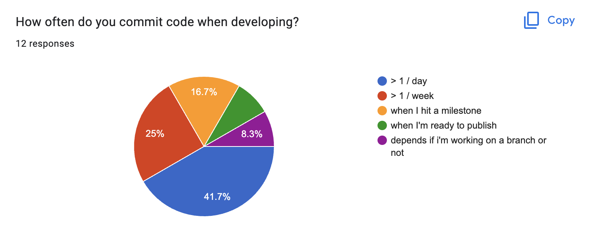
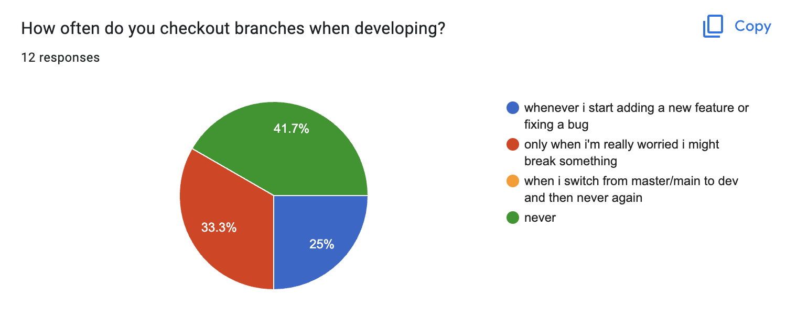
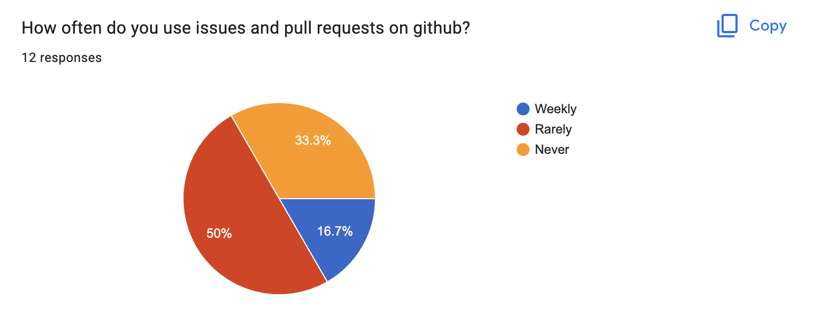
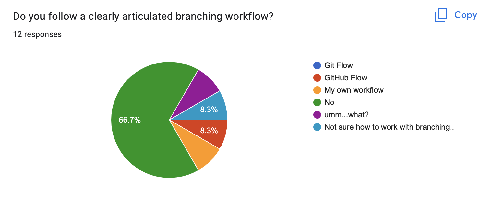

# Git/GitHub Workflows
## Brody Lab Tips & Tricks

Tyler Boyd-Meredith

Monday 02/06/2023

# Contents
0. [What is Git?](#what-is-git) [What is GitHub?](#what-is-github)
1. The basics
    - [use Git at the command line](#the-basics-using-git-at-the-command-line)
    - [create a local Git repository](#creating-a-repository)
    - [make commits](#adding-a-file)
    - [link it to a remote on GitHub](#linking-to-a-github-repository)
    - [cloning a repo from GitHub](#cloning-an-existing-github-repo)
    - [view the commit history](#cloning-an-existing-github-repo)
    - [checking out branches](#checking-out-a-branch-and-adding-to-it)
2. Branching workflow conventions
    - [single-branch](#single-branch)
    - [git-flow](#git-flow)
    - [GitHub Flow](#github-flow)
3. Using GitHub
    - [Pull Requests](#pushing-the-branch-and-opening-a-pull-request)
        - [Dealing with conflicts](#dealing-with-conflicts-during-the-pull-request)
    - [Create Issues](#creating-issues)
    - [Project Boards](#my-workflow)
    - Protect branches, set up status checks
4. [**MY FAVORITE WORKFLOW**](#my-workflow) - *Skip straight here for the good stuff*
5. [Resources](#resources)
6. [Survey Results](#survey-results)

---

# What is Git?

<table border="0">
 <tr>
    <td>

- A **distributed** version control system that lets you take **snapshots** of your code as you work and maintain separate **branches** of versions of the code

- Snapshots provide a recoverable record of the project's history

- Distributed means the full history of a project can be shared by many collaborators

- Branches can help you avoid situations like this...
<!-- terminal output for bings model likelihood -->
<p align="center">

</p>

</td>
    <!-- distributed repos image -->
    <td></td>
 </tr>
</table>

The Git graphic comes from the
[Git Pro Book](https://git-scm.com/book/en/v2/Getting-Started-About-Version-Control) which is extremely helpful for the basics and a high level of detail. Plus, you can clone the [repo](https://github.com/progit/progit2) that generates the book and see their Git usage in action!


---

# What is GitHub?

- A remote host for the repository (i.e., the Server Computer in the diagram above)
    - The authoritative version of a project shared with collaborators
    - backup the work that would be lost if your local machine crashed

- A website with a bunch of nice interfaces for managing collaborative projects
    - Issues, Pull Requests, Project Boards

---

# The Basics: Using Git at the command line


 ## Creating a repository

It can be really helpful to create an example project where the stakes are low to practice learning git.

So, let's open a terminal, create a new project folder and initialize a git repository

```bash
$ cd <path-to-parent-directory>
$ mkdir example_project
$ cd example_project
$ git init
```

Now, if we run
```bash
$ ls -1a
```

 we see a folder called `.git/`, which is where all the version control magic happens.

## Adding a file

Now, we have an empty repository. Let's create a README for it and add that document to the repository.

```bash
$ echo "I'm just trying to learn to use git" > README.md
$ git status
```

You should see that you have an **untracked** file called `README.md`. Let's tell Git about this file, by running
```bash
git add README.md
```

The file is now being tracked AND it is **staged** to be part of the next snapshot (aka commit), which we'll make now
```bash
git commit -m "Add README"
```

Let's look at the resulting record
```bash
git log --stat
```

This will show us that we've created a new file with one line in it.

---

# Linking to a GitHub repository

This is great, but we want to put our repository someplace where we can (1) access it if our computer breaks and (2) share it with users of the software or collaborators on the project.

First, we'll create a repository with the same name at [github.com/new](https://github.com/new).




- Add a link to the remote version of the repository called origin
- Push the local version to the origin

```bash
$ git remote add origin https://github.com/<username>/example_project.git
$ git push -u origin master
```

- Using `-u` sets the origin to be upstream. You can omit it next time you push


---

# Cloning an existing GitHub repo

- Let's have a look at the Protocols directory

```bash
cd <Protocols-parent-directory>
git clone https://github.com/Brody-Lab/Protocols.git
```

Now, we have folder called Protocols with the `master` branch + access to other branches and the full history.

Here are some commands we can run to understand the project:

```bash
cd Protocols
git log --oneline -20
git log f53bfef7 -1 --name-status --relative-date
git log --author=boydmeredith --oneline
git log --pretty=short --shortstat -S StateMatrixSection @PBupsWT/
git log --all --oneline --graph
git log 05cce4d7 -p
```

---

# Adding Code

-  We're ready to start writing code! But first we should ask...

    **What branching conventions do we want to adopt?** (for our own projects)

    **What branching conventions are already in use on this project** (for collaborative projects)

- Some options:
    - Single branch
    - git-flow
    - GitHub Flow

---

# Single-branch

Everything happens on a single branch (usually called `main`/`master`/`mainline`)

Creating, staging, and commiting functions is straightforward. Whenever you have made some changes to code that you want to snap shot, you do the following:

```bash
$ git add my_first_function.py
$ git commit -m "Add first example function"
```

Pros:
- no complicated branching rules to enforce

Cons:
- commit history can get hard to read
- can be hard to recover a working version

Use this when:
- working **alone** on a very **small scale** project

Don't use this when:
- collaborating or writing code with more than a couple moving parts

---

# git-flow

<table border="0">
 <tr>
    <td>

The Rules
___
1. never develop on `master`

    &rarr; `master` always works/is ready for production

2. if `master` has a bug, make a `hotfix-<bugname>` branch

    when done, merge back to `master` & `develop`

3. new work happens on feature branches from `develop`

    when done, merge back to `develop`

4. when develop code is close to ready for production, make a `release` branch

    fix any remaining small bugs in `release` branch
    when done, merge into `master` & `develop` & create a release tag

<sub>Check out the 2010 [Blogpost describing git-flow](https://nvie.com/posts/a-successful-git-branching-model/)</sub>


</td>
    <td>
    
     </td>
 </tr>

</table>

Pros:

- Carefully separates working code from in progress
- You can maintain separate, stable releases

Cons:

- It's complicated to follow the rules
- There's a long path from develop back to production/deployment
- `develop`  and `main` are redundant

Use this when:

- You want to maintain stable releases
- You want to drive yourself insane

Don't use it when:
- You want to deploy[^1] your code on a regular basis (as we do in the rat room).

[^1]: It's note totally clear what the analogy of "deployment" or "production" is for a scientist working on their own project, but I would argue it's whenever we present findings and possibly whenever we run an analysis and interpret the results)

---

# GitHub Flow

The Rules (simpler than git-flow)
___

1. never develop on `main`/`master`

    if you want to add or change anything, checkout a descriptively named branch from `main` (as in git-flow, **`main` is always ready for use**, but unlike git-flow, there is no distinction in the flow a feature branch and a hotfix branch)

2. When you think the branch is ready for use, create a Pull Request to merge it into the remote `main` branch

3. Use the Pull Request to finalize the branch for merging into `main`

    identify and fix any remaining issues

    get comments from other users (you can even tag them to look at specific lines!)

4. Merge the Pull Request

5. Delete the feature branch

___

<table border="0">
 <tr>
    <td>
    Pros
    </td>
    <td>
    Cons
     </td>
</tr>
<tr>
     <td>

- Carefully separates working code from in progress

- New code can get into `main` quickly

- It's pretty easy to follow the rules
    </td>
    <td>

    - Fewer levels of stability

     </td>
</tr>
<tr>
<td>
    Use this when:
    </td>
    <td>
    Don't use this when:
     </td>
     </tr>
     <tr>
     <td>

- You want to deploy regularly
    </td>
    <td>

    - You need stable releases

     </td>
</tr>
</table>

---

# Let's practice

## Checking out a branch and adding to it

```bash
$ touch practice_function.py
$ git checkout -b practice-branch
$ git add practice_function.py
$ git commit -m "add function to practice branching"
```

## Pushing the branch and opening a pull request

```bash
$ git push origin practice-branch
```

If we do this at the command line, we will be prompted to open a Pull Request and given a link we can click to get straight there!

We can also create one by going to `github.com/<username>/example_project/pulls`, clicking the green "New pull request" button and choosing the `practice-branch` as the compare branch.

We could skip all that and go straight to `github.com/<username>/example_project/compare/master...practice-branch`

Here, we can ask for help from collaborators by tagging them with `@<username>`.

Go try it! If there are no conflicts with the main branch and no required status checks are violated, you can now merge the pull request into the main branch! Or, maybe you'll notice there's still something that needs to be dealt with before the code gets merged...

When you merge the pull request, you'll be prompted for comments, if this PR addresses an Issue, you can write that this PR "Closes #\<issue-number>" and that Issue will automatically be closed. Pretty cool!

---

## Addressing the Pull Request

After making the Pull Request, you may notice an issue that should be fixed before merging into the `main` branch. No problem! Just make the fixes, commit them and push the branch again.

```bash
$ git add practice_function.py
$ git commit -m "fixed bug identified in PR"
$ git push origin practice-branch
```

## Dealing with conflicts during the Pull Request

Now, if you merge the pull request, it will contain the most recent code!

If the main branch has changed since you checked out your branch, there may be conflicts that need to be resolved. If so, pull down the main branch using

```bash
$ git pull origin master
```

You'll be told that you need to resolve conflicts before you can merge. After you've resolved the conflicts in your preferred editor, you can make a commit that merges the master branch into your feature branch. Now, if you push that branch ([as we did above](#addressing-the-pull-request)), you'll see that you can now merge your pull request.

Once you've done that, delete your feature branch on GitHub (it will prompt you to do this) and then checkout the master branch, pull the new work and delete the feature branch locally.

```bash
$ git checkout master
$ git pull origin master
$ git branch -d practice-branch
```

---

# Creating Issues

In scientific projects, we often have a laundry list of analyses that we'd like to run, edge cases we'd like to check, possible bugs we want to investigate. This can be hard to keep track of, especially in a way that is integrated with the code. Issues provides a fantastic solution to this problem by giving you a change to link a description of the problem (including markdown, latex, and images) to your code. This can help you document your plans and concerns as you work and gives you an easy to find record of which problems are open (have yet to be addressed) and which have been closed. You can link these to specific updates to the code by adding "Closes #\<issue-numer>" to your Pull Request merge comments.

github.com/\<username>/example_project/issues

---

# My workflow
(aka GitHub Flow<sup>+</sup>)

I started using a workflow at the end of my PhD and found it incredibly helpful not just for maintaining my code, but for identifying and addressing scientific questions in my project. The contours of this workflow were suggested to me by Brody Lab alum Alex Piet, so eternal thanks to him for that.

Steps:
1. **Create a project board** by going to github.com/\<username\>?tab\=projects and choose the board layout. The automatic configuration will be 3 lists, "To Do", "In Progress", "Done."

2. **Create a To Do List** in your project board

    To create a To Do Item:

    - Click the "+ Add item" button at the bottom of the "To do" column and write in a descriptive name of a To Do item.

    - Click the "..." in the upper right of your new issue and choose a repository to link to. This will automatically create an Issue assigned to the chosen repository.

    - Click the feature name to add a description by pressing "edit" in the upper right corner of the description box. You can type markdown, latex, add pictures and you can even make a checklist by making a list with "- [ ]". These will be recognized as metadata and as you check them off, will tell you how many of the total tasks you've completed".

3. **Pick something to work on** and drag it to "In Progress"

    - Try to keep only 1 or 2 items in this column. If items stay there for many days, split them into 2 or more items and use a PR to move the completed work into the "Done" column.

4. **Follow GitHub Flow to do the work** associated with this To Do item (i.e., checkout a branch, edit things, make commits, push branch to remote, open PR, merge PR with "Closes #\<issue-numer>")

    - As you work, update the comments on this To Do item to document decisions you've made or new things you've learned.
    - If you work on the problem for more than a few days, break the item into one that you've finished and one containing the work left to be done.

5. **Watch the "Done" column fill up** with a nicely documented list of issues you've addressed!

Here's an example of what the one I'm using for the wait time model project looks like. You can explore it [here](https://github.com/orgs/Brody-Lab/projects/1/views/1).



---

# Protecting the main branch

To be extra careful that the main branch never breaks, we can setup protections, here are some examples:

- Requiring Pull Requests to merge branches into `main`
- Locking `main` so users can't push to it
- Requiring Status Checks to complete PRs
- Setting up status checks
    - Using GitHub Actions, you can set up workflows that run every time you open a pull request. For example, you could write a bunch of unit tests, make them automatically run whenever you open a PR and then you can see that none of your new code breaks any of the things you're testing for. You can then wait to merge PR until all the tests pass, or you can even make it impossible to merge the PR until the tests pass.

---

# Setting up the command prompt

If you're using git at the command line, it's nice if the prompt tells you which branch you're on. Here are the command prompts that I use:

- If using bash, modify `~/.bash_profile`
    ```bash
    parse_git_branch() {
        git branch 2> /dev/null | sed -e '/^[^*]/d' -e 's/* \(.*\)/ (\1)/'
    }
    export PS1="\u@\h \[\033[31m\]\W\[\033[92m\]\$(parse_git_branch)\[\033[00m\] $ "
    ```
- If using zsh, modify `~/.zshrc`
    ```bash
    # Load version control information
    autoload -Uz vcs_info
    precmd() { vcs_info }

    # Format the vcs_info_msg_0_ variable
    zstyle ':vcs_info:git:*' formats 'on %b'
    # Set up the prompt (with git branch name)
    setopt PROMPT_SUBST
    PROMPT='%n in ${PWD/#$HOME/~} ${vcs_info_msg_0_}
    %# '
    ```
    &uarr; this one is kind of ugly, I should replace with a better one
---

# Resources

[Git Pro Book](https://git-scm.com/book/en/v2/Getting-Started-About-Version-Control) is a great in depth explanation of how to use GitHub

[Merely useful tech book](https://merely-useful.tech/py-rse/git-cmdline.html) has 2 nice, short sections on Git and GitHub

[git-flow](https://nvie.com/posts/a-successful-git-branching-model/) was presented in this blog post

[GitHub Flow](https://docs.github.com/en/get-started/quickstart/github-flow) is documented here

[Good Research Code Handbook](https://goodresearch.dev/_static/book.pdf) not super git focused, but very helpful

---


# Survey results...

<div class="grid grid-cols-[50%,50%] gap-0">
<div>

- Lots of people using git!



</div>

<div>

- Fewer people checking out branches...



</div>
</div>


<div class="grid grid-cols-[50%,50%] gap-0">
<div>

- Not much usage of Issues or Pull Requests




</div>

<div>

- Minimal usage of clear branching conventions



</div>
</div>

---