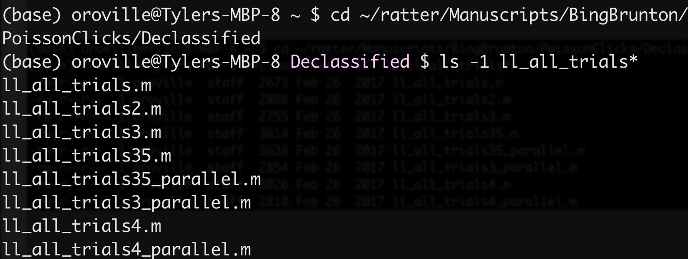
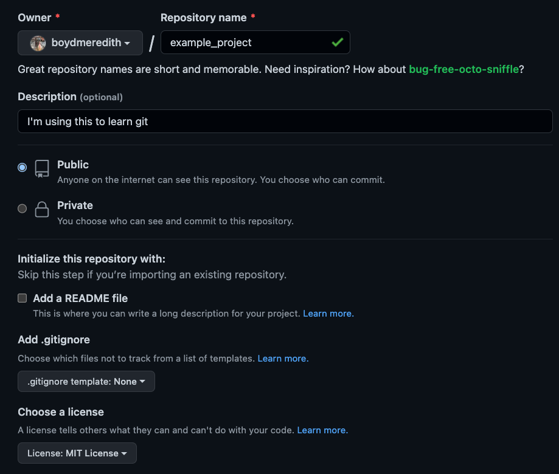

<!-- this is a note-->

# Git/GitHub Workflows
## Brody Lab Tips & Tricks

Tyler Boyd-Meredith

Monday 02/06/2023

---
layout: default
---

# What we'll cover today

1. The basics
    - Initialize a local Git repository and link it to a remote on GitHub
    - Make commits, tags, view the commit history, checkout previous commits
    - Checkout and merge branches
2. Branching workflow conventions
    - single-branch
    - git-flow
    - GitHub Flow (&larr; the one I like)
3. Good GitHub usage
    - Create Issues, Pull Requests, and Project Boards
    - Protect branches, set up status checks

---

<div class="grid grid-cols-[60%,280px] gap-10">
<div>

# What is Git?

- A **distributed** version control system that lets you take **snapshots** of your code as you work and maintain separate **branches** of versions of the code

- Snapshots provide a recoverable record of the project's history

- Distributed means the full history of a project can be shared by many collaborators

- Branches can help you avoid situations like this...

<p align="center">

</p>


</div>
<div>

&nbsp;


<div style="text-align: right">

[From Git Pro](https://git-scm.com/book/en/v2/images/distributed.png)

</div>

</div>
</div>

---

<div class="grid grid-cols-[60%,280px] gap-10">
<div>

# What is GitHub?

- A remote host for the repository (i.e., the Server Computer in this diagram)
    - The authoritative version of a project shared with collaborators
    - backup the work that would be lost if your local machine crashed

- A website with a bunch of nice interfaces for managing collaborative projects
    - Issues, Pull Requests, Project Boards


</div>
<div>

&nbsp;


<div style="text-align: right">

[From Git Pro](https://git-scm.com/book/en/v2/images/distributed.png)

</div>

</div>
</div>

---

# The Basics: Using Git at the command line


<div class="grid grid-cols-[50%,50%] gap-10">
<div>

 ## Creating a repository

 Open a terminal, create a new project folder and initialize a git repository

```ts
$ cd <path-to-parent-directory>
$ mkdir example_project
$ cd example_project
$ git init
```

Now, if we run
```ts
$ ls -1a
```

 we see a folder called `.git/`, which is where all the version control magic happens.
</div>
<div>

## Adding a file

```ts
$ echo "I'm just trying to learn to use git" > README.md
$ git status
```

You should see that you have an **untracked** file called `README.md`. Let's tell Git about this file, by running
```ts
git add README.md
```

The file is now being tracked AND it is **staged** to be part of the next snapshot, which we'll make now
```ts
git commit -m "Add README"
```

Let's look at the resulting record
```ts
git log --stat
```
</div>
</div>

---

# Linking to a GitHub repository

<div class="grid grid-cols-[45%,55%] gap-10">
<div>

Create a repository with the same name at [github.com/new](https://github.com/new)


</div>
<div>
&nbsp;

- Add a link to the remote version of the repository called origin
- Push the local version to the origin

```ts
$ git remote add origin https://github.com/<username>/example_project.git
$ git push -u origin master
```

- Using `-u` sets the origin to be upstream. You can omit it next time you push

</div>
</div>

---

# Adding Code

-  We're ready to start writing code, but first, we have a decision to make:

    **Which branching conventions do we want to adopt?**

- Some options:
    - Single branch
    - git-flow
    - GitHub Flow

---

# Using a single-branch

- Everything happens on a single branch (called `main/master/mainline`)

```ts
$ vim my_first_function.py
$ git add my_first_function.py
$ git commit -m "Add first example function"
```

| **Pros** | **Cons** |
|---|---|
| no complicated branching rules | commit history is hard to read |
|  | can be hard to recover a working version |

&nbsp;

| **Use this when** | **Don't use it when** |
|---|---|
| working **alone** on a very **small scale** project | collaborating or writing code with more than a couple moving parts

---

<div class="grid grid-cols-[60%,50%] gap-10">
<div>

# git-flow


1. never develop on `main`

    &rarr; `main` always works/is ready for production

2. If `main` has a bug, make a `hotfix-<bugname>` branch

    when done, merge back to `main`

3. new work happens on feature branches from `develop`

    when done, merge back to `develop`

4. when develop code is close to ready for production, make a `release` branch

    fix any remaining small bugs in `release` branch, merge into `main`, create a release tag

</div>
<div>

<Transform :scale=".8">


</Transform>

</div>
</div>

---

<div class="grid grid-cols-[60%,50%] gap-10">
<div>

# git-flow

| **Pros** | **Cons** |
|----|----|
| Carefully separates working code from in progress | It's complicated to follow the rules |
You can maintain separate, stable releases | There's a long path from develop back to production |
| | `develop`  and `main` are redundant |

&nbsp;

| **Use this when** | **Don't use it when** |
|---|---|
| You want to maintain stable releases | You want to deploy your code on a regular basis  |
| You want to drive yourself insane | |


</div>
<div>

<Transform :scale=".8">


</Transform>

</div>
</div>

---

# GitHub Flow
Simpler than git-flow

<div class="grid grid-cols-[50%,50%] gap-10">
<div>

1. never develop on `main`; if you want to add or change anything, checkout a descriptively named branch from `main`

     (as in git-flow, **`main` is always ready for use**)

2. When you think the branch is ready for use, create a Pull Request to merge it into the remote `main` branch

3. Use the Pull Request to identify and fix Issues

4. Merge the Pull Request

5. Delete the feature of topic branch

</div>
<div>

| **Pros** | **Cons** |
|----|----|
| Carefully separates working code from in progress | Fewer levels of stability |
It's pretty easy to follow the rules |  |

&nbsp;

| **Use this when** | **Don't use it when** |
|---|---|
| You want to deploy regularly |  You need stable releases |

</div>
</div>

---

# Let's practice

## Checking out a branch and adding to it

```ts
$ touch practice_function.py
$ git checkout -b practice-branch
$ git add practice_function.py
$ git commit -m "add function to practice branching"
```

## Pushing the branch and opening a pull request

```ts
$ git push origin practice-branch
```

This will prompt us to open a Pull Request

Here, we can ask for help from collaborators by tagging them with `@<username>`

---

# Let's practice

## Addressing the PR

```ts
$ vim practice_function.py
$ git add practice_function.py
$ git commit -m "fixed bug identified in PR"
$ git push origin practice-branch
```

## Updating the local repo

Now, we can close practice-branch on the remote and then sync everything locally

```ts
$ git checkout -b master
$ git pull origin master
$ git branch -d practice-branch
```

---

# Project Boards

0. Create a project by going to [https://github.com/\<username\>?tab\=projects](https://github.com/boydmeredith?tab=projects)

1. Raise an Issue associated with a repo

2. Follow GitHub Flow to close the issue

---

# Protecting the main branch
- Requiring Pull Requests to merge branches into `main`
- Locking `main` so users can't push to it
- Requiring Status Checks to complete PRs

## Setting up status checks
- GitHub Actions

---
# Resources
--

[Git Pro Book](https://git-scm.com/book/en/v2/Getting-Started-About-Version-Control) is a great in depth explanation of how to use GitHub

[Merely useful tech book](https://merely-useful.tech/py-rse/git-cmdline.html) has 2 nice, short sections on Git and GitHub

[git-flow](https://nvie.com/posts/a-successful-git-branching-model/) was presented in this blog post

[GitHub Flow](https://docs.github.com/en/get-started/quickstart/github-flow) is documented here


